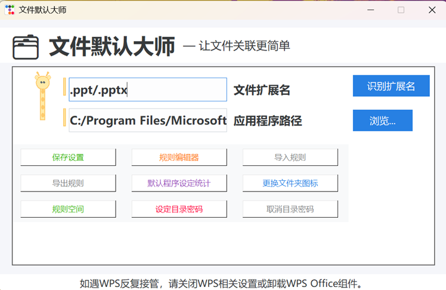

<b>
File Default Master</b>

  <a href="README_en.md" style="font-size:18px;text-decoration:none;">English</a> | <a href="README.md" style="font-size:18px;text-decoration:none;">中文</a>

#  Tool for Setting Default Programs

This is a Windows tool used to set the default opening program for file extensions. People often need to specify a default application in Windows to open a certain file extension (for example, using Edge to open .html files instead of Lenovo Browser). However, it is often the case that the change works temporarily but fails to take effect after a reboot. Therefore, I developed this tool, fix_default_app.exe, to help users quickly select the default application for a specific file extension, with the settings remaining effective after computer restart.

## Overview of Main Functions

File Default Master is a Windows-based tool for setting and managing default programs for file extensions, with the following main functions:  

- **Batch Default Program Setting**  
  Supports entering multiple extensions at once to uniformly set default opening programs, significantly improving file association efficiency.  

- **Rule Management and Priority Sorting**  
  Features a graphical drag-and-drop rule editor, allowing users to add, edit, delete, and sort all file association rules, enabling flexible management of default opening methods for different extensions.  

- **Rule Import/Export**  
  Allows exporting all custom rules to a JSON file for easy backup, migration, and sharing. Users can also import rule files with one click to quickly restore settings.  

- **Default Program Statistics and Search**  
  Automatically scans all system extensions and their current default programs, displaying them in a table. Supports fuzzy search for extensions or program paths, facilitating quick location and inspection of association statuses.

- **Global Shortcut Activation**  
  Supports pressing the **Ctrl+P** shortcut key to invoke the main interface at any time, facilitating quick operations and management.  

- **Rule Space (Network Function)**  
  Users can register, log in, and upload local rules to the "Rule Space". They can browse, download, rate, and report rules shared by others. It supports tag filtering and keyword search, enabling cloud-based sharing and communication of rules.
 

- **Folder Icon Customization**  
  Supports customizing folder icons by automatically converting images to ICO format and applying them, enhancing folder辨识度 (visibility) and personalization.  

- **Directory Encryption/Decryption**  
  Allows setting passwords for folders to hide and protect their contents. Contents can be restored by entering the password, ensuring data security.  

- **Compatibility and Ease of Use**  
  Utilizes both Windows Command Line and Registry settings, compatible with Windows 10/11. Features a clean and intuitive interface for convenient operation, suitable for all users.  

### Technical Features  
- **Cross-Platform and Easy Maintenance**: Implements a modern graphical interface using tkinter and ttkbootstrap.  
- **Dual Mechanism of Command Line and Registry**: Ensures compatibility and persistence of file association settings.  
- **Batch Processing and Priority Sorting**: Supports batch operations and multi-rule priority sorting. Rules are stored in structured JSON format for easy import/export and team collaboration.  
- **Rule Space with Flask RESTful API**: The server-side uses Flask RESTful API, with all data persisted as JSON files. Supports multi-user functionality, rating, tagging, reporting, etc.  
- **Multi-Format Icon Conversion**: The folder icon module automatically converts multiple image formats to ICO and generates desktop.ini files, compatible with Windows Explorer.  
- **Secure Encryption with SHA256**: The directory encryption function uses SHA256 hashing to protect passwords, with contents hidden in special subdirectories for enhanced security.  
- **Global Shortcut Listening**: Monitors global shortcuts to invoke the main interface from the background at any time.  
- **Modular Code Structure**: Clear code architecture with decoupled modules, facilitating extension and secondary development.  
- **Wide Compatibility**: Supports Windows 10/11, automatically elevates administrator privileges, and adapts to mainstream office environments.  

**File Default Master** —— Make your Windows file association management more efficient, intelligent, and professional!

## Usage Instructions  
1. Run `fix_default_app.py`.  
2. Enter the file extension (e.g., `.txt` or `.doc/.docx`).  
3. Select the application path (the specified default application path can be the real path of the application or a shortcut, ending with `.exe`).  
4. Click the "Save Settings" button.  
5. Use the "Rule Editor" to manage all association rules, or import/export rule files.  
6. Click "Default Program Settings Statistics" to view and search the default programs for all system extensions.

## Dependencies
- Python 3.8+
- tkinter
- pyinstaller(打包)
- keyboard
- requests  

## Frequently Asked Questions

### Q: What should I do if the default program path differs from my local installation path when downloading/applying others' rules in the Rule Space?  

A:  
The Rule Space of File Default Master supports automatic identification and replacement of local program paths. When you download and apply rules shared by others, the software will automatically scan your local system to locate the actual installation paths of the specified applications (such as `notepad.exe`, `wps.exe`, etc.) on your computer. If a local program with the same name is found, the rule will automatically replace the path with your local path and apply the rule. If the program is not found locally, this rule will not be applied—only rules for which the corresponding application can be scanned in your local system will take effect.  

**Notes:**  
- The automatic search traverses the system PATH, common installation directories (such as `C:\Program Files`, `C:\Windows\System32`, etc.), the user's desktop, and download directories to maximize compatibility with different users' installation environments.  
- If you do not have a program installed locally, the corresponding rule will not take effect.  
- After applying rules, it is recommended to check the application path of each rule in the "Rule Editor" to ensure the paths are correct.  
- When uploading rules, it is recommended to specify the name and version of the program used in the description to facilitate others in finding and matching them.  

### Q: How does File Default Master solve the problem of inconsistent installation paths for the same program among different users in the Rule Space?  

A:  
When downloading and applying others' rules in the "Rule Space," File Default Master will automatically scan the local system to locate the actual installation paths of the specified applications (such as `notepad.exe`, `wps.exe`, etc.) on your computer. The specific implementation is as follows:  

When applying a rule, the software extracts the `app` field (i.e., the application path) from each rule in the rule set to obtain the executable file name.  
First, it checks whether the original path in the rule exists locally. If it does, the original path is used directly.  
If the original path does not exist, it automatically searches for the executable file with the same name in the local system's PATH environment variable, common installation directories, user desktop, download directory, and other locations.  
If a program with the same name is found, the local actual path will automatically replace the original path and apply the rule; if not found, the rule will not be applied.  
This maximizes compatibility with different users' installation environments, achieving "rule sharing with localized paths."  

**Summary:**  
You do not need to manually modify the paths. File Default Master will automatically help you "intelligently match" local available program paths, applying only the rules that can be found locally to ensure cross-user compatibility and ease of use in the Rule Space.  

**Examples:**  
- If the path in the Rule Space rule is `C:\Program Files\A.exe`, but your local installation is in `D:\MyApps\A.exe`, as long as the file name is `A.exe`, it will automatically match and apply.  
- If you do not have `A.exe` locally, this rule will not be applied.  

**Note:**  
Due to Windows security policy restrictions, .pdf files require manual specification of the default program in the system settings and cannot be fully automated.
